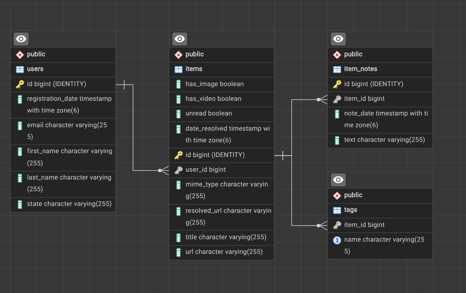

# Later


## Бэкэнд для сервиса ведения заметок

**Учебный проект**

### Основные возможности
- Регистрировать пользователей
- Сохранять ссылки на страницы интернета от имени пользователя.
  - При сохранении ссылки приложение автоматически получает метаинформацию о странице
- Добавлять пользоваельские заметки к сораненным ссылкам
- Добавлять теги к своим заметкам
- Поиск ссылок с фильтрацией по различным параметрам ссылки
- Поиск ссылок по фамилии пользователя, сохранившего ее
- Поиск заметки по части адреса ссылки
- Поиск своих заметок по тегам
- Поиск N последних своих заметок
- Получение количества ссылок у пользователей по дате или по url
- Получение краткого списка ссылок пользователя

### Сущности
- **User** - Пользователь
- **Item** - Данные о интернет-странице
- **Note** - Заметка пользователя привязанная к Item

Параметр `userId` передается в заголовках запроса `X-Later-User-Id`

Пример Item:
```json
{
        "id": 1,
        "normalUrl": "https://habr.com/ru/companies/skillfactory/articles/656423/",
        "resolvedUrl": "https://habr.com/ru/companies/skillfactory/articles/656423/",
        "mimeType": "text",
        "title": "Cron — лучшие практики / Хабр",
        "hasImage": true,
        "hasVideo": false,
        "unread": true,
        "dateResolved": "2026.09.19 08:40:44",
        "tags": [
            "linux",
            "chrono"
        ]
    }
```

Пример Note:
```json
{
    "id": 1,
    "itemId": 1,
    "text": "Это заметка",
    "dateOfNote": "2026.09.19 08:53:57",
    "itemUrl": "https://habr.com/ru/companies/skillfactory/articles/656423/"
}
```

### Http API

```text
API
├── 🌐/items
│   ├── GET /items?lastName=
│   ├── GET /items/count?url=
│   ├── GET /items/users/:userId
│   ├── GET /items/count/date?from=&to=
│   ├── GET /items?state=&contentType=&sort=&limit=&tags=
│   ├── POST /items
│   ├── PATCH /items
│   └── DELETE /items
│
├── 🌐/notes
│   ├── GET /notes
│   ├── GET /notes?tag=
│   ├── GET /notes?url=
│   └── POST /notes
│
└── 🌐/users
    ├── GET /users
    └── POST /users
```

### Database map

